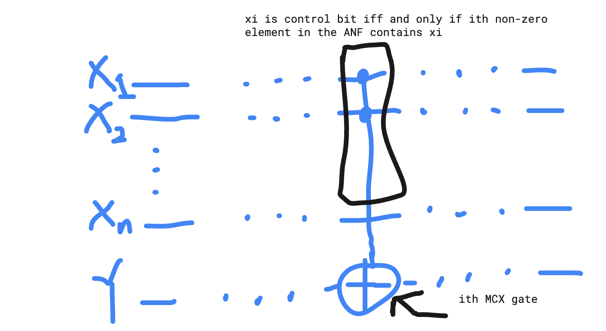

## Usage

```python

# ------------------------------------------------------------------------
# example usage
# ------------------------------------------------------------------------

f = lambda x1, x2, x3: (x1 + x2 * x3) >= 1
(circuit, x_bits, y_bits) = quantum_boolean_circuit_no_to_gate(f)
circuit.draw(output="mpl")


n = 3
f = lambda x1, x2, x3: (x1 + x2 * x3) >= 1
truth_table = compute_truth_table(f,n)

anf = compute_ANF(truth_table,n)
m, _ = anf.shape
U_f_circuit = quantum_boolean_circuit(f) 
```

# Quantum Computing 

# Algebraic Normal Form of a Boolean Function

Let $f(x):\{0,1\}^n \mapsto \{0,1\}$ be a Boolean function. Then its ANF is a way to express $f(x)$ as
```math
\begin{align*}
f(x) =& a_0 \oplus \\
&a_1x_1\oplus \dots \oplus a_nx_n\oplus \\
&a_{1,2} x_1x_2  \oplus \dots \oplus a_{n-1,n}x_{n-1}x_n\oplus \\
&\dots \oplus\\
&a_{1,\dots,n}x_1\dots x_n
\end{align*}
```
where each $a_0,a_1,\dots,a_{1,\dots,n}\in\{0,1\}$.

# Circuit for $|x\rangle |y \rangle \mapsto |x\rangle | f(x) \oplus y\rangle$.

Consider the following picture





Suppose ANF for $f(x)$ can be written
```math
\begin{align*}
f(x) = \sum_{i\in I} \prod_{j\in S_i}x_j
\end{align*}
```
where $I$ and  $S_i$ are some index sets. Then we associate every set $S_i$ a MCX gate, the ith MCX gate, as follows.

The target bit of ith MCX gate is Y. The control bits of ith MCX gate are the set of $x_j$ such that $x_j\in S_i$.  Let's analyze the correctness of the circuit next.

If   $x_j=1$ for all $x_j\in S_i$, then this MCX gate is "activated" and the target bit is applied an X gate, i.e. $|\text{target bit}\rangle \mapsto |\text{target bit}\oplus 1\rangle$.


If   $x_j=0$ for some $x_j\in S_i$, then identity map is applied to the target bit, i.e. $|\text{target bit}\rangle \mapsto |\text{target bit}\oplus 0\rangle$.

Combining gives $|\text{target bit}\rangle \mapsto |\text{target bit}\oplus \prod_{j\in S_i}x_j \rangle$.

Now for each $S_i$, it is associated with such a MCX gate. Therefore, we get
```math
|y\rangle \mapsto |y\oplus \sum_{i\in I}\oplus \prod_{j\in S_i}x_j \rangle=|y\oplus f(x)\rangle
```


# Computation of ANF

ANF of $f(x)$ is computed by appying Walsh-Hadamard transform on the truth table (written in terms of a vector in $\{0,1\}^{ \text{len} (x) }$) of $f(x)$.

Reference: Chapter 2.2, Proposition 8, page 67 of Boolean Functions for Cryptography and Coding Theory (link: https://www.math.univ-paris13.fr/~carlet/book-fcts-Bool-vect-crypt-codes.pdf)
